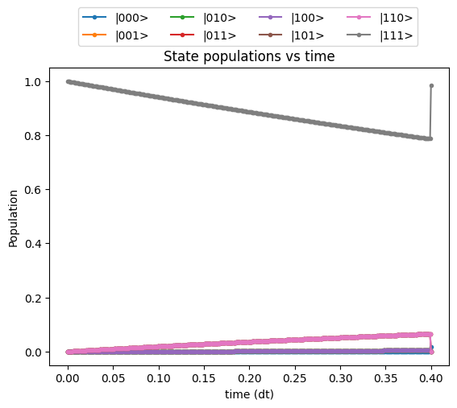
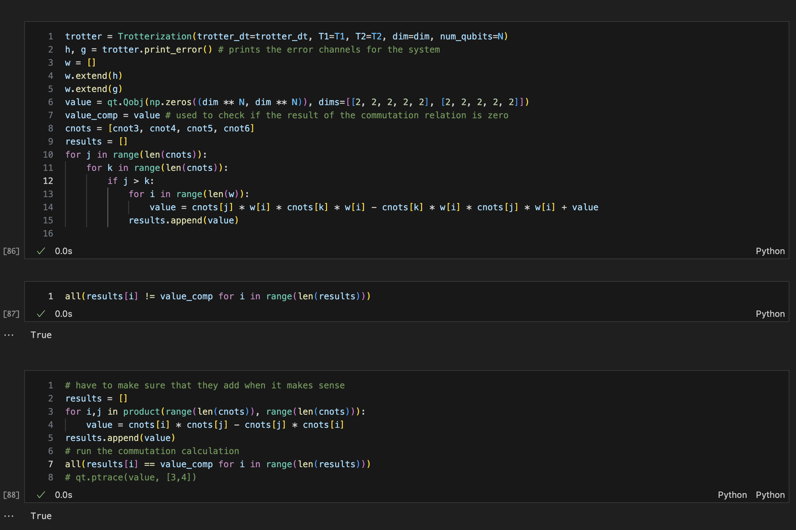
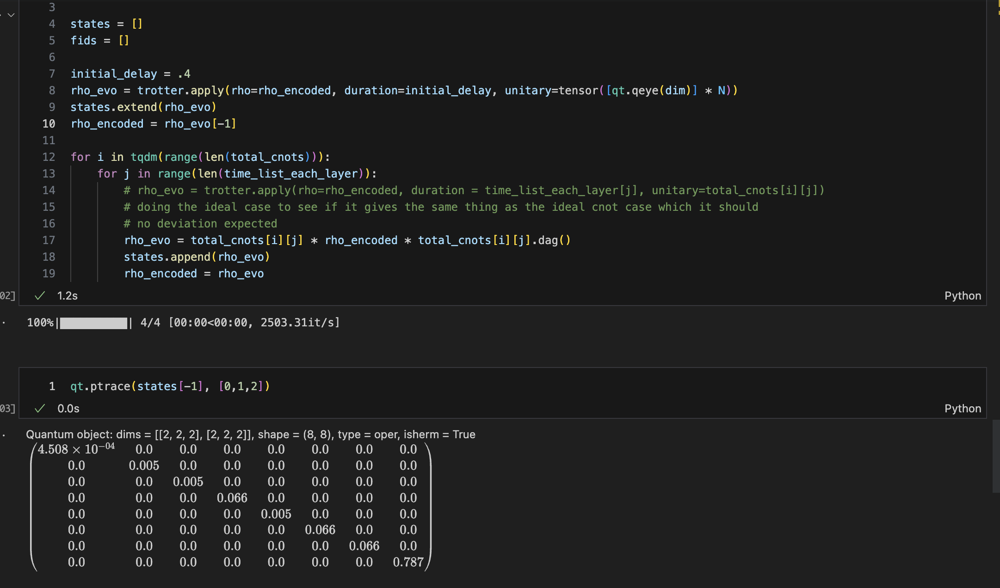
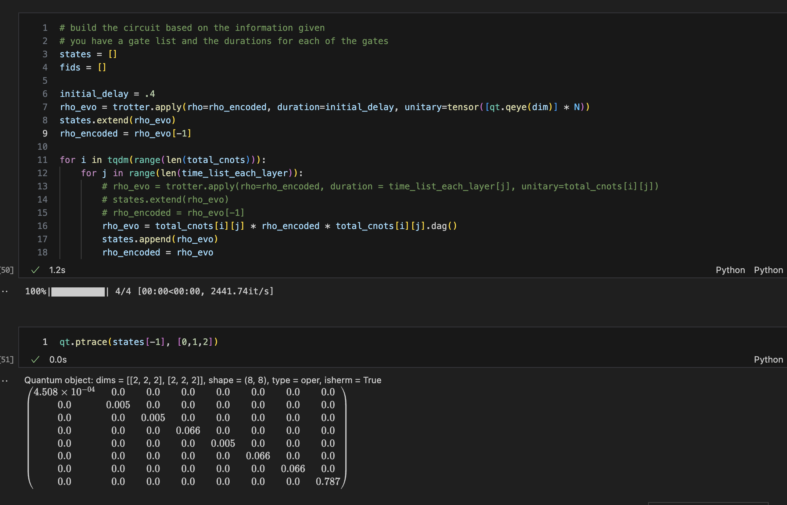
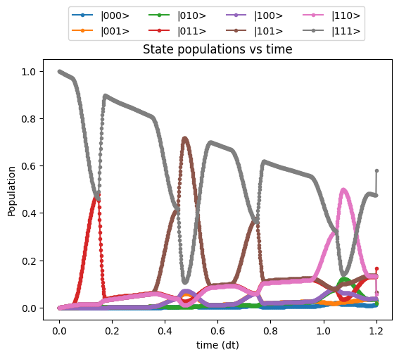
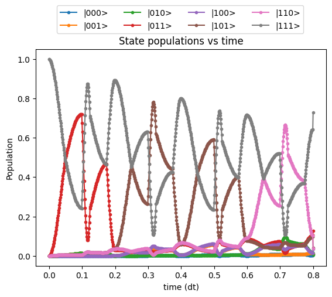

# Results:
## permutations:
1. in the ideal case as expected the permutations do not change the outcome of the state. 

   - Replacing the order of the parity checker gives the exact same value(Z12Z23 -> Z23Z12)
   - Populations of states: [0.016777174888248685, 0.0, 0.0, 0.0, 0.0, 0.0, 0.0, 0.9832228251117512] (remains the same no matter the order of the CNOTs)
2. Non-ideal case ordering of CNOTs

   - Conventional ordering of the CNOTs 
     - State populations:
       - [0.004069555301552084, 0.0028006208338477393, 0.0021601014784675796, 0.07726657827069658, 0.020923844401830254, 0.02575586009054478, 0.026670788591385754, 0.8403526510316752]
   - Flipping the parity operators as done for the ideal case gives a worse results 
     - State population after flipping order:
       - [0.004668619984619602, 0.050960196224184996, 0.0027363093480934917, 0.04138947514097577, 0.0015830161285460172, 0.011678570381678924, 0.06073130829125871, 0.8262525045006425]
3. Proof of why I would expect a change only with error channels taken into account 

## different decompositions 
0. confirming that these decompositions give the expected result in the ideal case 
   1. iSWAP:
   2. 
   3. sqrtiSWAP:
   4. 
   5. conclusion: These decompositions are correct. This implies that what is observed in the non-ideal case can only be correct as well
1. iSWAP results:

   - Populations: [0.0295041630230921, 0.021373469464033214, 0.01617442407181104, 0.16697089699539008, 0.06390858001816992, 0.06433391556670744, 0.057745542610603606, 0.5799890082501925]
1. sqrtiSWAP results:

   - Populations: [0.012633288991963983, 0.009127305472949385, 0.006348924998941279, 0.12818454278549893, 0.03429290453771086, 0.04218541336186663, 0.03906241582106264, 0.7281652040300063]
1. compare to CNOT:

   - Populations: [0.004069555301552091, 0.0028006208338477423, 0.0021601014784676043, 0.07726657827069729, 0.0209238444018304, 0.025755860090544744, 0.02667078859138702, 0.8403526510316732]
1. Conclusions:
   1. Seems like the direct CNOT is better than any CNOT decomp this is partially due to the fact that the other decomps take more time but they also spend different times in different subspaces of the system. 
   2. try it with the unitaries being made to be normalized maybe this provides a difference to the results
## Phase flip correction codes 
1. ideal CNOTS: 

   - Populations: [0.006566072902159879, 0.0, 0.0, 0.0, 0.0, 0.0, 0.0, 0.9934339270978398]
2. Non-ideal CNOTS:

   - Populations: [0.004066947976818933, 0.0027932578289726483, 0.002153436985794665, 0.07720969362358863, 0.020920695047657416, 0.02569702657938487, 0.026625317265033758, 0.8405336246927487]
     - BEFORE WRAPPING THIS UP TRY DOING THIS SAME EXPERIMENT BUT CHANGE THE BASIS OF THE CNOT AND SEE HOW IT CHANGES THE SYSTEM (DO THIS ON PAPER FIRST TO SEE WHAT YOU GET)
     - WORK WITH THE ERROR CHANNELS AND SEE IF THE RESULTS ARE DIFFERNET 
1. Different decompositions:
      1. this is the next goal 
   1. iSWAP
   2. sqrtiSWAP

